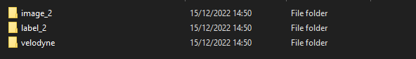

# Adaptive Cruise Control LiDAR Object detection and distance estimation using SFA3D and CARLA

[![python-image]][python-url]
[![pytorch-image]][pytorch-url]

---

## 1. Features
- [x] Super fast and accurate 3D object detection based on LiDAR
- [x] Fast training, fast inference
- [x] An Anchor-free approach
- [x] No Non-Max-Suppression
- [x] Support distributed data parallel training
- [x] Release pre-trained models 


## 2. Getting Started
### 2.1. Requirements

torch==1.5.0 <br>
torchvision==0.6.0 <br>
torchsummary <br>
easydict==1.9 <br>
opencv-python==4.2.0.34 <br>
numpy==1.18.3 <br>
tensorboard==2.2.1 <br>
scikit-learn==0.22.2 <br>
wget==3.2 <br>
tqdm==4.54.0 <br>
matplotlib==3.3.3 <br>
wandb <br>


### 2.2. Data Preparation

*   Open an instance of the CARLA simulator for a chosen town
*   Run the KITTI_data_generator.py file located in AIonWheels/DeeplearningLidar/METHOD2
*   The generated data will be saved in a folder structure

* To generate the correct labels on the CARLA dataset before starting the trainingsproces you have to run the GenerateLabels.py script located in AIonWheels/DeeplearningLidar/METHOD2/
* An additional script named PNGtoJPG.py is available in the same directory and can be used to reduces the size of the dataset.

Please make sure that the final construction of the directory for the  dataset looks as below : 

kitti > training > 



### 2.3. How to train

#### 2.3.1. How to train on local machine

*   Place the created folder in the dataset folder under SFA3D-master under the OBJECT DETECTION directory before running train.py
*   run the train.py file
*   You can add parameters while executing the train.py command to train with multiple GPU's in parallel (this is explained later in this document)


#### 2.3.3. How to train on GPU Lab

*   Due to computationaly expensive costs you can consider running this project using a GPU Lab
*   First you can build and create a docker image using the dockerfile provided in AIonWheels/DeeplearningLidar/OBJECT_DETECTION/
*   Using this docker image you can train your model as desired

#### 2.3.3.1 Docker commands for training

- Docker pull and run command:
- sudo docker pull xosmium/aionwheels
- sudo docker run -itd --name=AIonWheels --mount type=bind,source=<DATASET_DIR>,target=/home/user/application/dataset --mount type=bind,source=<CHECKPOINTS_DIR>,target=/home/user/- application/checkpoints s107661/aionwheels


### 2.4 Parallel Training

##### 2.3.4.1. Single machine, single gpu

```shell script
python train.py --gpu_idx 0
```

##### 2.3.4.2. Distributed Data Parallel Training
- **Single machine (node), multiple GPUs**

```
python train.py --multiprocessing-distributed --world-size 1 --rank 0 --batch_size 64 --num_workers 8
```

- **Two machines (two nodes), multiple GPUs**

   - _**First machine**_
    ```
    python train.py --dist-url 'tcp://IP_OF_NODE1:FREEPORT' --multiprocessing-distributed --world-size 2 --rank 0 --batch_size 64 --num_workers 8
    ```

   - _**Second machine**_
    ```
    python train.py --dist-url 'tcp://IP_OF_NODE2:FREEPORT' --multiprocessing-distributed --world-size 2 --rank 1 --batch_size 64 --num_workers 8
    ```


### 2.4 Testing


The trained models are per 5 epochs saved as snapshots. You can test the pre-trained model by running the test.py script provided in AIonWheels/DeeplearningLidar/OBJECT_DETECTION/


### 2.5 Logs on Weights ands Biases

The logs of the losses during training can be visualised using Weights and Biases.


## References

[1] Object detection: [SFA3D](https://github.com/maudzung/SFA3D) <br>